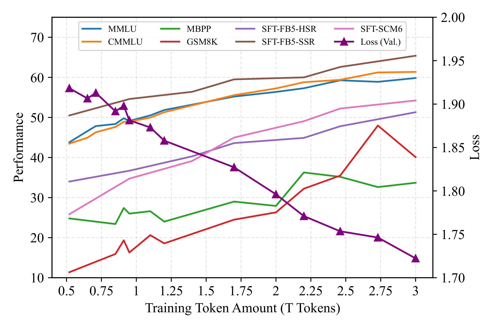
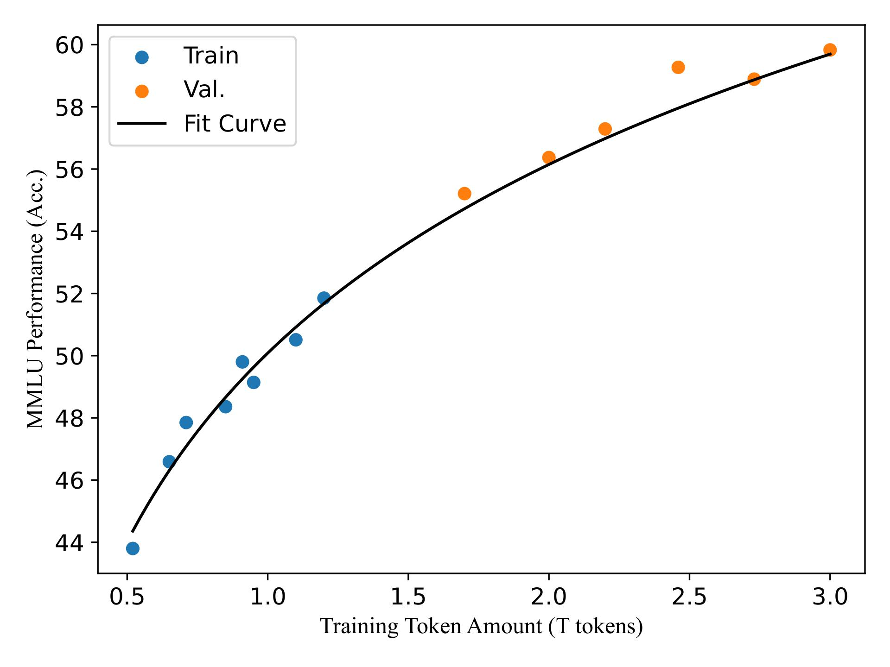

# BaichuanSEED: <u>S</u>haring the Potential of <u>E</u>xtensiv<u>E</u> <u>D</u>ata Collection and Deduplication by Introducing a Competitive Large Language Model Baseline

Authors: Guosheng Dong*, Da Pan, Yiding Sun, Shusen Zhang, Zheng Liang, Xin Wu, Yanjun Shen, Fan Yang, Haoze Sun, Tianpeng Li, Mingan Lin, Jianhua Xu, Yufan Zhang, Xiaonan Nie, Lei Su, Bingning Wang, Wentao Zhang, Jiaxin Mao, Weipeng Chen, Zenan Zhou*

*Corresponding Authors, {[dongguosheng](mailto:dongguosheng@baichuan-inc.com), [zhouzenan](mailto:zhouzenan@baichuan-inc.com)} @baichuan-inc.com

[Paper]() [Github](https://github.com/BaichuanSEED/BaichuanSEED.github.io) [Huggingface]()

## Main Contribution

1. We propose a universally applicable data processing pipeline, including broad collection to scale up and reweighting to deduplicate and improve the data quality. 
2. We train a competitive 7B LLM baseline **BaichuanSEED** from scratch with 3T data processed by the aforementioned pipeline, followed by a simple yet effective supervised fine-tuning. Our model is **consistent** and **predictable**, and achieves comparable performance on comprehensive benchmarks with cutting-edge commercial LLMs without any deliberate optimization.

## Universal Data Processing Pipeline

The details can be found in our technical report. The pipeline mainly consists of: 

- Broad Collection: broad collection from trusted sources, mainly including web pages, high knowledge density data, code.
- Reweighting: deduplication and mixture
    - Deduplication
        - Document-level deduplication globally
        - Sentence-level deduplication across documents
        - PII and harmful content filtering
    - Mixture
        - Heauristic mixture experiments

## Evaluation

### Attributes

- Consistency: the ability to gain uniform improvements across all evaluation benchmarks before and after SFT. (upper picture)
- Predictable: the ability to forecast the capabilities of later checkpoints based on performance of earlier checkpoints. (lower picture)

### Comprehensive Benchmarks

| Model                | Training Tokens | MMLU (5-shot) | CMMLU (5-shot) | AGIEval (0-shot) | C-Eval (5-shot) | MMLU-Pro (5-shot) | LiveBench (0-shot) |
|----------------------|-----------------|---------------|----------------|------------------|-----------------|-------------------|--------------------|
| **Baichuan2-7B**     | 2.6T            | 54.65         | 56.95          | 28.95            | 56.19           | 21.65             | -                  |
| **Baichuan2-13B**    | 2.6T            | 59.83         | 61.32          | 24.07            | 58.10           | 26.59             | -                  |
| **Qwen1.5-7B**       | 3T              | _62.19_       | **71.84**      | **39.46**        | **73.64**       | _30.30_           | -                  |
| **Llama3-8B**        | 15T             | **66.57**     | 50.68          | 26.74            | 49.89           | **35.30**         | -                  |
| **OLMo-7B**          | 2.5T            | 28.40         | 25.55          | 19.89            | 27.27           | 13.05             | -                  |
| **MAP-Neo-7B**       | 4.5T            | 58.18         | 55.06          | _33.87_          | 57.50           | 26.89             | -                  |
| **BaichuanSEED**     | 3T              | 60.25         | _62.09_        | 31.07            | _61.58_         | 26.57             | -                  |
|                      |                 |               |                |                  |                 |                   |                    |
| **Baichuan2-7B-Chat**| 2.6T            | 54.35         | 55.36          | 35.29            | 55.09           | 25.11             | 12.89              |
| **Baichuan2-13B-Chat**| 2.6T           | 57.28         | _61.32_        | 30.15            | 58.04           | 28.03             | 13.04              |
| **Qwen1.5-7B-Chat**  | 3T              | _61.49_       | **68.02**      | **39.29**        | **68.96**       | 16.29             | 16.78              |
| **Llama3-8B-Instruct**| 15T            | **67.10**     | 51.66          | _38.37_          | 50.71           | **41.88**         | **25.91**          |
| **OLMo-7B-SFT**      | 2.5T            | 47.49         | 35.49          | 29.12            | 35.43           | 17.99             | 8.80               |
| **MAP-Neo-7B-SFT**   | 4.5T            | 58.31         | 55.24          | 37.98            | 55.58           | _30.24_           | 14.35              |
| **BaichuanSEED-SFT** | 3T              | 60.15         | 60.84          | 32.62            | _59.41_         | 29.63             | _18.32_            |
|                      |                 |               |                |                  |                 |                   |                    |

### Downstream Tasks

| Model                  | Training Tokens | MBPP (3-shot) | HumanEval (0-shot) | MATH (4-shot) | GSM8K (4-shot) | TriviaQA (0-shot) | HellaSwag (0-shot) |
|------------------------|-----------------|---------------|--------------------|---------------|----------------|-------------------|--------------------|
| **Baichuan2-7B**       | 2.6T            | 25.40         | 17.68              | 5.94          | 25.02          | 53.73             | 67.56              |
| **Baichuan2-13B**      | 2.6T            | 30.88         | 17.07              | 10.68         | 52.08          | _58.73_           | 71.09              |
| **Qwen1.5-7B**         | 3T              | _36.60_       | **53.05**          | **21.08**     | **54.74**      | 50.92             | _72.64_            |
| **Llama3-8B**          | 15T             | **44.60**     | _26.22_            | 13.44         | 50.11          | **65.23**         | **74.54**          |
| **OLMo-7B**            | 2.5T            | 21.00         | 11.59              | 1.72          | 2.00           | 49.81             | 70.31              |
| **MAP-Neo-7B**         | 4.5T            | 25.90         | 7.93               | _15.14_       | _53.90_        | 54.80             | 67.85              |
| **BaichuanSEED**       | 3T              | 34.12         | 21.34              | 9.84          | 38.81          | 45.92             | 70.20              |
|                        |                 |               |                    |               |                |                   |                    |
| **Baichuan2-7B-Chat**  | 2.6T            | 22.40         | 15.24              | 8.70          | 32.37          | 44.65             | 69.18              |
| **Baichuan2-13B-Chat** | 2.6T            | 26.30         | 18.90              | 8.62          | 56.79          | 53.47             | 72.32              |
| **Qwen1.5-7B-Chat**    | 3T              | 12.58         | **29.27**          | 13.12         | 56.10          | 10.22             | 72.81              |
| **Llama3-8B-Instruct** | 15T             | **52.17**     | 21.34              | _25.62_       | **78.17**      | **63.37**         | 71.45              |
| **OLMo-7B-SFT**        | 2.5T            | 25.16         | 19.51              | 2.52          | 17.66          | 42.87             | _72.62_            |
| **MAP-Neo-7B-SFT**     | 4.5T            | 33.66         | **29.27**          | **30.86**     | _70.28_        | _53.82_           | 68.48              |
| **BaichuanSEED-SFT**   | 3T              | _37.60_       | _23.17_            | 14.06         | 53.98          | 43.92             | **73.03**          |
|                      |                 |               |                |                  |                 |                   |                    |

## Citation

TBU